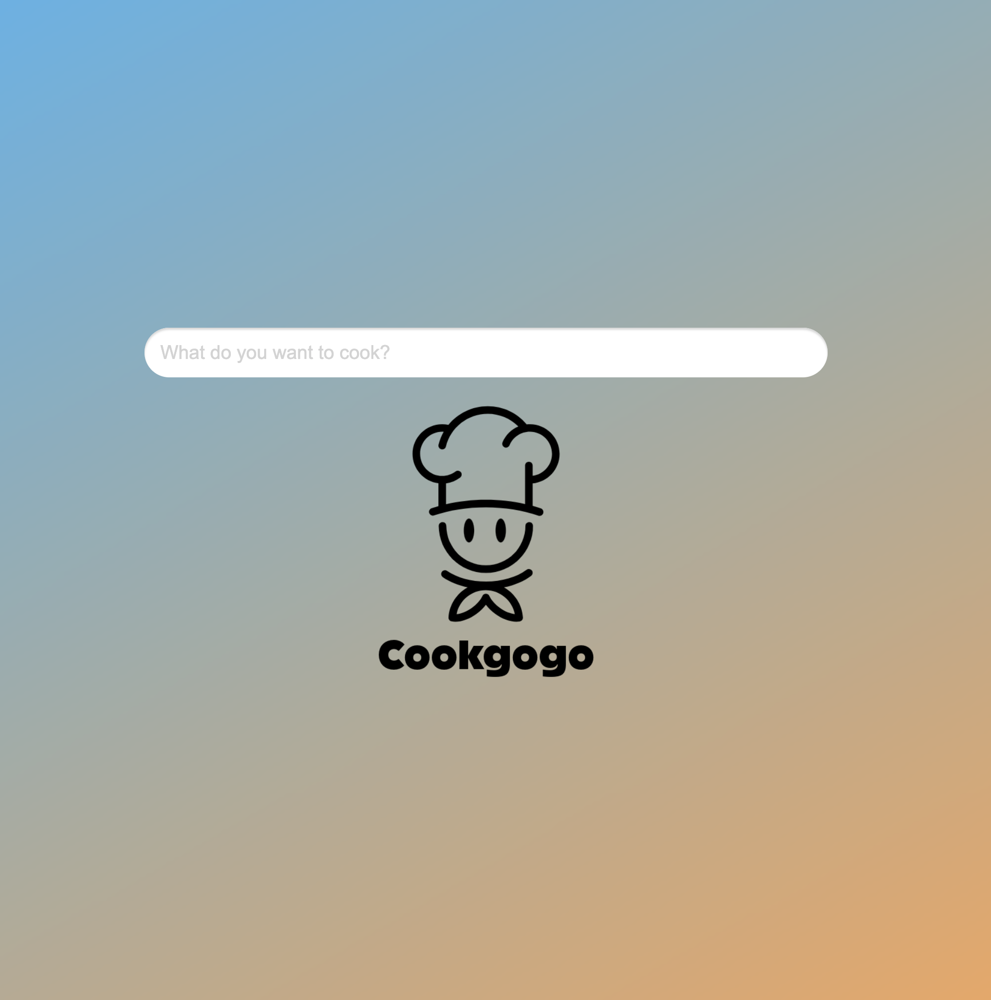

# Cookgogo
Cookgogo is a multilingual recipe web app that uses Chrome’s Prompt API to generate cooking recipes based on the user’s input language. Users can type in any language, and the app automatically creates ingredients and step-by-step instructions in the same language. Each step is clickable to mark it as completed.

## Features
	•	Multilingual input (English, Korean, Japanese, Chinese, etc.)
	•	AI-generated recipes using Prompt API
	•	Clickable steps to track cooking progress
	•	Runs locally in Chrome for privacy

## Getting Started
- Clone this repository:
  ```git clone https://github.com/94yahui/cookgogo.git```

- Open index.html in Google Chrome
- Type a dish name in your language and view the generated recipe
- Click steps to mark them as completed

## Demo
You can access the live demo here: [https://cookgogo.vercel.app/](https://cookgogo.vercel.app/)



## Please make sure you are running desktop Chrome on a supported system ⬇️:

### Supported Operating Systems:
	•	Windows 10 or 11
	•	macOS 13 or later (Ventura or newer)
	•	Linux
	•	ChromeOS version 16389.0.0 or higher on Chromebook Plus devices

### Storage:
At least 22 GB free space on the drive containing your Chrome profile.

### Hardware:
	•	GPU: VRAM greater than 4 GB (optional, for GPU acceleration)
	•	CPU: 16 GB RAM or more and 4+ CPU cores

### Network:
Unlimited or unmetered connection recommended.

